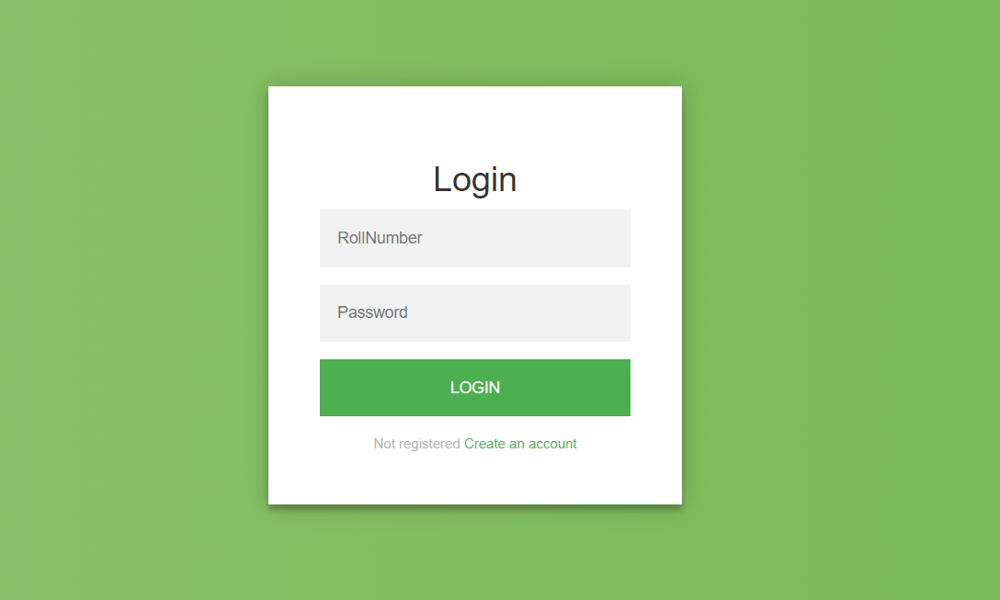

# CP_Portal

-Used web scraping to get students' details from competitive websites like Codeforces, Codechef using BeautifulSoup4 (Python).

-Students can login/signup to view the standings of the university students who do competitive programming. 

-The total score of is student is computed by their ratings on Codeforces, Codechef using webscraping from these websites.

-The common standings page has search feature and has filters of search on the basis of Year and Branch of student.

-The profile of a student displays the graph of its total score plotted using CanvaJS.

-Also maintained database connectivity by MySQL and gave user authentication. Used HTML, CSS, Bootstrap, PHP.

# ScreenShots

## SignUp

## Login

## Standings

## Profile

